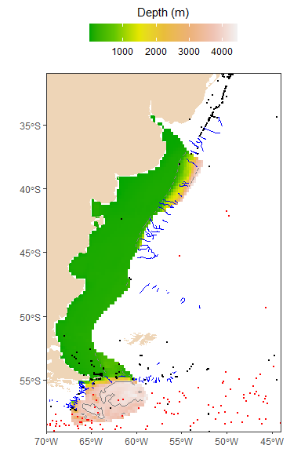
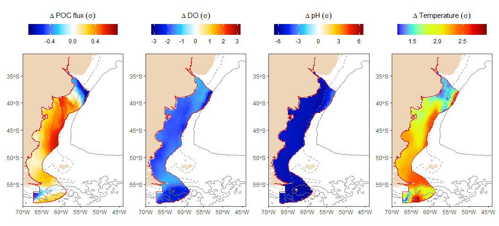
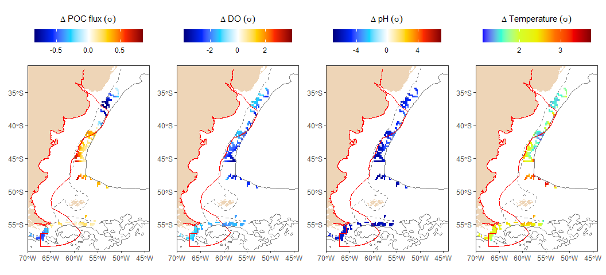
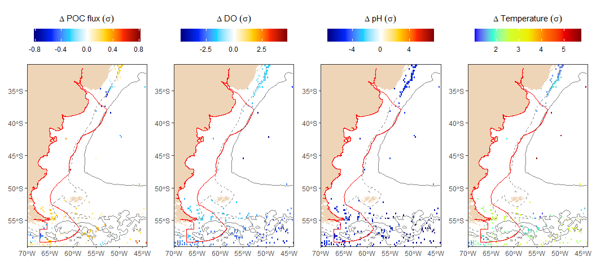
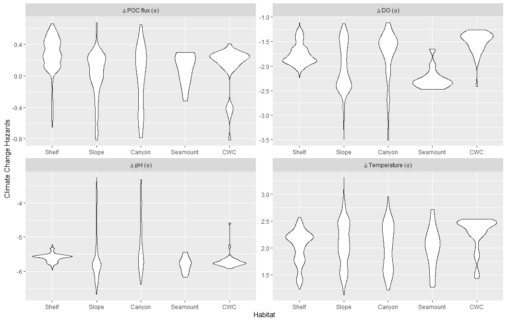
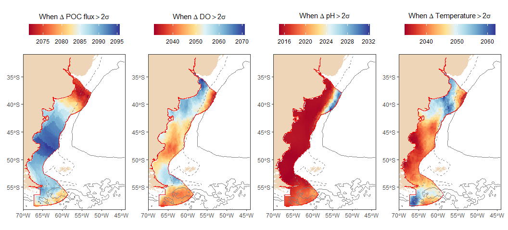
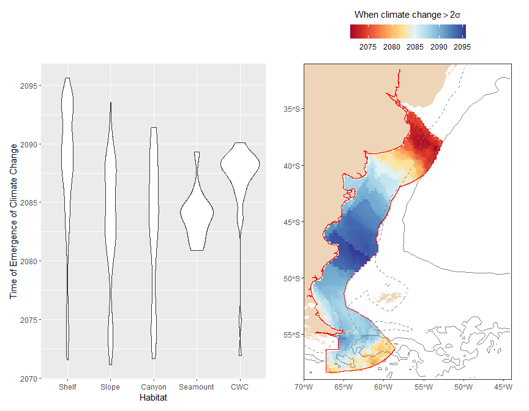
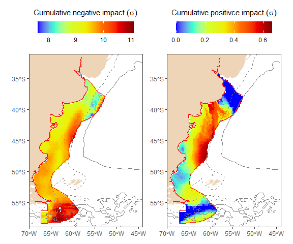
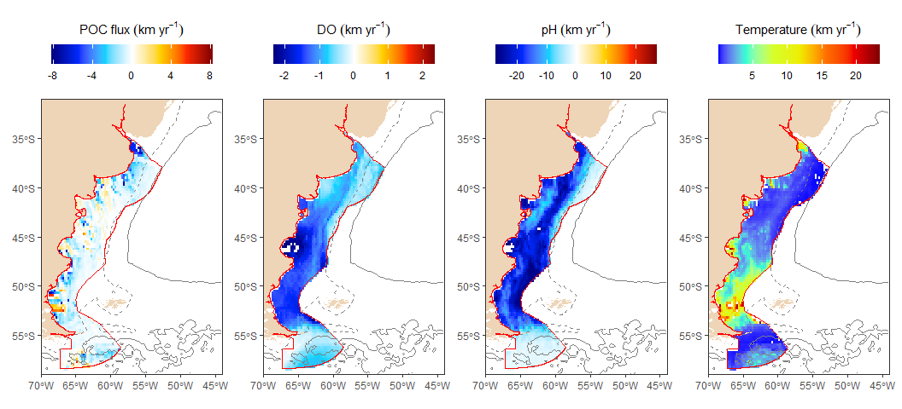
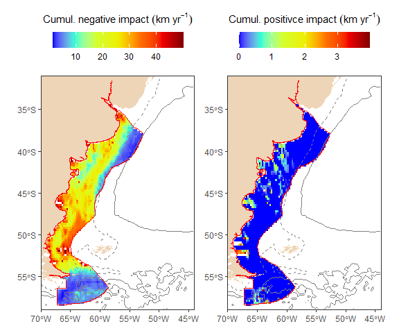

Extract seafloor climate change data by polygon, polyline, or points
================
Chih-Lin Wei
2024-08-13

``` r
library(ArgentinaSSP245)
library(ggplot2)
library(dplyr)
library(patchwork)
library(tidyr)
library(RColorBrewer)
library(sf)
```

# Seafloor habitats within Argentina EEZ

In this analysis, we want to extract and display [Argentina
EEZ’s](https://marineregions.org/gazetteer.php?p=details&id=8466)
seafloor climate change data. We can do that by
[mask](https://www.rdocumentation.org/packages/raster/versions/3.6-26/topics/mask)ing
the
[etopo2022](https://www.ncei.noaa.gov/products/etopo-global-relief-model)
raster with Argentina EEZ. We can see that the Argentina EEZ consists of
continental shelf (0-200 m) and continental slope (200-4000 m). The
shelf is indicated by gray dashed contour lines and the slope by gray
solid contour lines. Additionally, submarine canyons [(Harris and
Whitway, 2011)](https://doi.org/10.1016/j.margeo.2011.05.008) are
indicated by blue solid lines, seamounts [(Kim and Wessel,
2011)](https://doi.org/10.1111/j.1365-246X.2011.05076.x) by red dots,
and cold water corals [(CWC)](http://data.unep-wcmc.org/datasets/3) by
black dots.

``` r
bathy <- etopo2022  %>% mask(eez) %>% as.data.frame(xy = TRUE)
ggplot(bathy) +
      geom_raster(aes(x=x, y=y, fill=-layer))+
      geom_polygon(data=arg, aes(x=X, y=Y, group=PID), fill="bisque2", colour="transparent")+
      #geom_sf(data=as(eez, "sf"), fill="transparent", colour="red")+
      geom_contour(data=bathy, aes(x=x, y=y, z=layer), breaks=-200, linetype=2, colour="gray50")+
      geom_contour(data=bathy, aes(x=x, y=y, z=layer), breaks=-4000, linetype=1, colour="gray50")+
      geom_sf(data=as(canyon, "sf"), colour="blue")+
      geom_sf(data=as(seamount, "sf"), size=0.5, colour="red")+
      geom_sf(data=as(coral, "sf"), size=0.5, colour="black")+
      scale_fill_gradientn(colours=terrain.colors(7), na.value="white")+
      scale_x_continuous(expand = expansion(mult = 0))+
      scale_y_continuous(expand = expansion(mult = 0))+
      labs(x=NULL, y=NULL, fill=NULL, title="Depth (m)")+
      theme_bw() %+replace% theme(legend.position = "top", legend.key.width =  unit(1, 'cm'), plot.title = element_text(hjust=0.5))
```

<!-- -->

We can use the same [ggplot](https://ggplot2.tidyverse.org/) wrap
function to generate multi-panel plots. The custom plot function use the
same four parameters, including:

- r: A rasterbrick containing the data.
- vt: A character vector of the new raster titles
- colours: A vector of colors to use for the color key.
- limits: A numeric vector of length two providing quantile limits for
  the color key scale.

``` r
plot_fun <- function(r, vt=names(r), colours=NULL, q_limits=c(0.001, 0.999)){
  
  # Convert raster to data frame and then to list
  cmip6 <- as.data.frame(r, xy = TRUE) %>%
  gather(-x, -y, key = "var", value = "value", factor_key = TRUE)
  cmip6$var <- factor(cmip6$var, labels = vt)
  cmip6_list <- cmip6 %>% group_split(var)
  
  # Depth
  bathy <- etopo2022%>% as.data.frame(xy = TRUE)
  
  # ggolot list
  gg_list = lapply(cmip6_list, function(dat) {
    
    # Color key limits and colours
    lim1 <- quantile(dat$value, q_limits, na.rm=TRUE)
    lim2 <- max(abs(quantile(dat$value, q_limits, na.rm=TRUE)))
    # If the raster only have positive values, use sequential color palettes
    if(min(lim1) >= 0) {
      lims <- lim1; cols <- jet.colors2(7)
    # If the raster contains negative values, use diverging color palettes
    } else {
      lims <- c(-lim2, lim2); cols <- jet.colors3(7)}
    # If color pallette is specified, use the specified color palette
    if(is.null(colours)) cols <- cols else cols <- colours
      
    # Plot raster layer
    ggplot(dat) +
      geom_raster(aes(x=x, y=y, fill=value))+
      geom_polygon(data=arg, aes(x=X, y=Y, group=PID), fill="bisque2", colour="transparent")+
      geom_sf(data=as(eez, "sf"), fill="transparent", colour="red")+
      geom_contour(data=bathy, aes(x=x, y=y, z=layer), breaks=-200, linetype=2, colour="gray50")+
      geom_contour(data=bathy, aes(x=x, y=y, z=layer), breaks=-4000, linetype=1, colour="gray50")+
      scale_fill_gradientn(colours=cols, limits=lims, na.value="white")+
      scale_x_continuous(expand = expansion(mult = 0))+
      scale_y_continuous(expand = expansion(mult = 0))+
      labs(x=NULL, y=NULL, fill=NULL, title=parse(text=dat$var[1] %>% as.character))+
      facet_wrap(~ var) +
      theme_bw() %+replace% theme(legend.position = "top", legend.key.width =  unit(1, 'cm'), plot.title = element_text(hjust=0.5), strip.background = element_blank(), strip.text = element_blank())
      })
  
  # Wrap ggplot list
  wrap_plots(gg_list, nrow=1)
}
```

# Climate change hazards

For example, we can mask the climate change hazards between 2041 and
2060 by the Argentina EEZ polygon. The following maps show the degree of
climate change (or climate change hazards) from 2041 to 2060 in the unit
of historical variability from 1951 to 2000. We can see the variations
within the EEZ better this way.

``` r
plot_fun(r=cmip6_2041_2060_exsd %>% subset(1:4) %>% mask(eez),
         vt = c("Delta~POC~flux~(sigma)", "Delta~DO~(sigma)", "Delta~pH~(sigma)", "Delta~Temperature~(sigma)"))
```

<!-- -->

We can also show climate change hazards between 2041 and 2060 in
submarine canyons

``` r
plot_fun(r=cmip6_2041_2060_exsd %>% subset(1:4) %>% mask(canyon),
         vt = c("Delta~POC~flux~(sigma)", "Delta~DO~(sigma)", "Delta~pH~(sigma)", "Delta~Temperature~(sigma)"))
```

<!-- -->

The climate change hazards between 2041 and 2060 on seamounts and cold
water corals are plotted together.

``` r
# Mask raster layers by seamount and CWC and then merge them together 
out <- merge(cmip6_2041_2060_exsd %>% subset(1:4) %>% mask(seamount), cmip6_2041_2060_exsd %>% subset(1:4) %>% mask(coral))
names(out) <- names(cmip6_2041_2060_exsd)[1:4]
plot_fun(r=out, vt = c("Delta~POC~flux~(sigma)", "Delta~DO~(sigma)", "Delta~pH~(sigma)", "Delta~Temperature~(sigma)"))
```

<!-- -->

Here, we mask the raster layers of climate change hazards by spatial
objects (i.e., polygons, polylines, or spatial points) and use violin
plots to show the climate change hazards from 2041 to 2060 within
Argentina EEZ separated by a 200-m depth contour (i.e., continental
shelf vs. slope). We can also show the projections of submarine canyons
and seamounts within the EEZ together.

``` r
# Custom function to mask habitats
mask_habitat <- function(x){
  pred <- addLayer(etopo2022, x)
  # Mask continental margin
  ma <- pred %>% mask(eez) %>% as.data.frame(xy = TRUE) %>% na.omit
  ma$Habitat <- cut(-ma$layer, c(0, 200, 5000), labels=c("Shelf", "Slope"))
  # Mask submarine canyons
  sc <- pred %>% mask(canyon) %>% mask(eez) %>% as.data.frame(xy = TRUE) %>% na.omit
  sc$Habitat <- "Canyon"
  # Mask seamounts
  sm <- pred %>% mask(seamount) %>% mask(eez) %>% as.data.frame(xy = TRUE) %>% na.omit
  sm$Habitat <- "Seamount"
  # Mask cold water corals
  cwc <- pred %>% mask(coral) %>% mask(eez) %>% as.data.frame(xy = TRUE) %>% na.omit
  cwc$Habitat <- "CWC"
  # Combine and stack data frame
  rbind(ma, sc, sm, cwc) %>% gather(-x, -y, -layer, -Habitat, key = "var", value = "value", factor_key=TRUE)
}
```

``` r
out <- cmip6_2041_2060_exsd %>% subset(1:4) %>% mask_habitat
out$var <- factor(out$var, labels=c("Delta~POC~flux~(sigma)", "Delta~DO~(sigma)", "Delta~pH~(sigma)", "Delta~Temperature~(sigma)"))

ggplot(data=out)+
  geom_violin(aes(x=Habitat, y=value))+
  facet_wrap(~var, scales="free", nrow=2, labeller=label_parsed)+
  labs(y="Climate Change Hazards")
```

<!-- -->

# Time of emergence of climate changes

The following maps and violin plots illustrate when climate changes
exceed two times the historical standard deviation (or the year when the
value of climate change hazards \> 2). We use two times of the standard
deviation because in a roughly normal data set, values within one
standard deviation of the mean account for about 68% of the set, while
values within two standard deviations account for about 95%.

``` r
plot_fun(cmip6_extoe_constant %>% subset(1:4) %>% mask(eez), colours = brewer.pal(10, 'RdYlBu'), 
         vt=c("When~Delta~POC~flux>2*sigma", "When~Delta~DO>2*sigma", "When~Delta~pH>2*sigma", "When~Delta~Temperature>2*sigma"),
         q_limits = c(0, 1))
```

<!-- -->

``` r
out <- cmip6_extoe_constant %>% subset(1:4) %>% mask_habitat
out$var <- factor(out$var, labels=c("When~Delta~POC~flux>2*sigma", "When~Delta~DO>2*sigma", "When~Delta~pH>2*sigma", "When~Delta~Temperature>2*sigma"))

ggplot(data=out)+
  geom_violin(aes(x=Habitat, y=value))+
  facet_wrap(~var, scales="free", labeller=label_parsed)+
  labs(y="Time of Emergence of Climate Change")
```

<!-- -->

Next, we show the years when climate changes for export POC flux,
dissolved oxygen, pH, and temperature simultaneously exceed twice the
historical variability.

``` r
all <- overlay(subset(cmip6_extoe_constant, 1:4), fun=max) %>% mask(eez)
names(all) <- "cmip6_extoe_constant"

p1 <- plot_fun(r=all, vt="When~climate~change>2*sigma", colours=brewer.pal(10, 'RdYlBu'), q_limits = c(0, 1))

# Violin plots
p2 <- ggplot(data=mask_habitat(all))+
  geom_violin(aes(x=Habitat, y=value))+
  labs(y="Time of Emergence of Climate Change")
```

``` r
p2+p1
```

<!-- -->

# Cumulative impact of climate change hazards

Another application involves calculating the cumulative impacts of
climate change hazards. The negative hazards are caused by declining
export POC flux, deoxygenation, ocean acidification, and ocean warming.
The positive impacts are increasing export POC flux, oxygenation, ocean
basification, and ocean cooling. Here, we use the same function to
calculate cumulative negative and positive impacts caused by climate
change hazards.

``` r
cum_imp <- function(r){
  # Negative cumulative impact (exposure to climate change hazards for epc<0, o2<0, ph<0, and thetao>0)
  neg <- addLayer(calc(subset(r, 1:3), fun=function(x){x[x>0]<-NA; return(-x)}),
                    calc(subset(r, 4), fun=function(x){x[x<0]<-NA; return(x)})
                    ) %>%　overlay(fun=function(x)sum(x, na.rm=T))

  # Positive cumulative impact (exposure to climate change hazards for epc>0, o2>0, ph>0, and thetao<0)
  pos <- addLayer(calc(subset(r, 1:3), fun=function(x){x[x<0]<-NA; return(x)}),
                    calc(subset(r, 4), fun=function(x){x[x>0]<-NA; return(-x)})
                    ) %>%　overlay(fun=function(x)sum(x, na.rm=T))
  
  out <- addLayer(neg, pos)
  names(out) <- c("Negative", "Positive")
  out <- mask(out, etopo2022)
  return(out)
}
```

``` r
plot_fun(r=cum_imp(cmip6_2041_2060_exsd) %>% mask(eez),
         vt=c("Cumulative~negative~impact~(sigma)", "Cumulative~positivce~impact~(sigma)"))
```

<!-- -->

``` r
out <- cum_imp(cmip6_2041_2060_exsd) %>% mask_habitat
out$var <- factor(out$var, labels=c("Cumulative~negative~impact~(sigma)", "Cumulative~positivce~impact~(sigma)"))

ggplot(data=out)+
  geom_violin(aes(x=Habitat, y=value))+
  facet_wrap(~var, scales="free", labeller=label_parsed)+
  labs(y="Cumulative Climate Change Impact")
```

<!-- -->

# Climate velocity

An important factor for species’ survival is how quickly they need to
move to adjust to current environmental conditions and keep up with
climate changes. Local climate velocity can be calculated by measuring
the rate of change of a specific variable (like temperature) over time
and dividing it by the corresponding spatial gradient of that variable
within a 3x3 area. Areas with low local climate velocities may be good
candidates for protection, as they could act as climatic refuges and are
often associated with high levels of endemic species. It’s important to
note that in deep seafloor environments, like the abyssal plain, the
spatial gradient may be small, resulting in high climate velocities. Our
example shows the average seafloor gradient-based climate velocity
magnitudes from 2041 to 2060 within Argentina EEZ.

``` r
plot_fun(r=cmip6_2041_2060_voccMeg %>% subset(1:4) %>% mask(eez),
         vt = c("POC~flux~(km~yr^-1)", "DO~(km~yr^-1)", "pH~(km~yr^-1)", "Temperature~(km~yr^-1)"),
         q_limits=c(0.01, 0.99)
         )
```

<!-- -->

``` r
out <- cmip6_2041_2060_voccMeg %>% subset(1:4) %>% mask_habitat
out$var <- factor(out$var, labels=c("POC~flux~(km~yr^-1)", "DO~(km~yr^-1)", "pH~(km~yr^-1)", "Temperature~(km~yr^-1)"))

ggplot(data=out)+
  geom_violin(aes(x=Habitat, y=value))+
  facet_wrap(~var, scales="free", labeller=label_parsed)+
  labs(y="Climate Velocity Magnitudes")
```

<!-- -->

# Cumulative impact based on climate velocity

We can calculate the overall negative impact of climate velocity by
considering the impacts of decreasing food supply, deoxygenation,
acidification, and warming, as well as the positive impacts of
increasing food supply, oxygen levels, ocean basification, and cooling.
Conversely, the increase in export POC flux, oxygen levels, ocean
basification, and ocean cooling can be considered cumulative positive
impacts.

``` r
plot_fun(r=cum_imp(cmip6_2041_2060_voccMeg) %>% mask(eez), 
         vt=c("Cumul.~negative~impact~(km~yr^-1)", "Cumul.~positivce~impact~(km~yr^-1)"),
         q_limits = c(0, 0.99))
```

<!-- -->

``` r
out <- cmip6_2041_2060_voccMeg %>% cum_imp %>% mask_habitat
out$var <- factor(out$var, labels=c("Cumulative~negative~impact~(km~yr^-1)", "Cumulative~positivce~impact~(km~yr^-1)"))

ggplot(data=out)+
  geom_violin(aes(x=Habitat, y=value))+
  facet_wrap(~var, scales="free", labeller=label_parsed)+
  labs(y="Cumulative Climate Change Impact")
```

<!-- -->

# Excercises

- Display climate change hazards, cumulative impacts, and climate
  velocity magnitudes from 2081 to 2100 for Argentina’s Exclusive
  Economic Zone (EEZ), submarine canyons, seamounts, and cold water
  corals.
