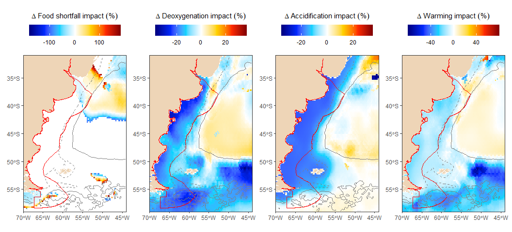
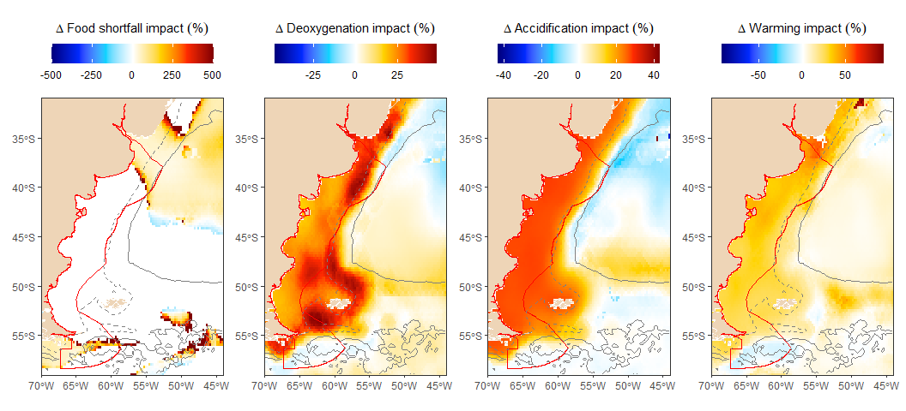
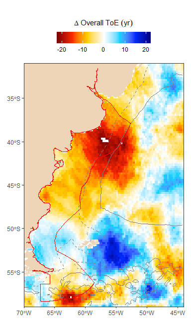
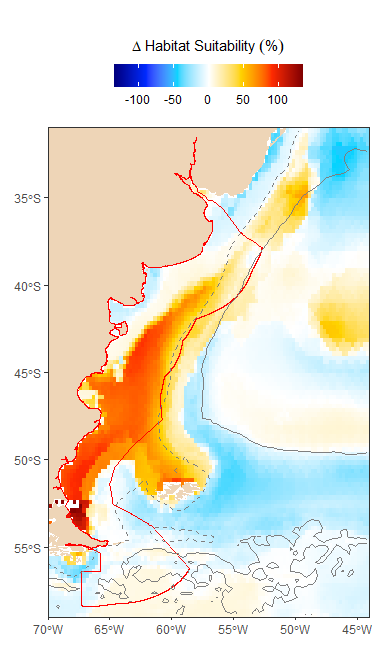

Model scenario comparisons
================
Chih-Lin Wei
2024-08-08

``` r
library(ArgentinaSSP126)
library(ArgentinaSSP245)
library(ArgentinaSSP585)
library(ggplot2)
library(dplyr)
library(patchwork)
library(tidyr)
library(RColorBrewer)
library(sf)
```

# Shared Socioeconomic Pathways (SSP)

In the context of the World Climate Research Programme’s Coupled Model
Intercomparison Project 6 (CMIP6), climate scientists have conducted
simulations to predict climate change in the 21st century. These
simulations were carried out based on the Shared Socioeconomic Pathways
(SSP) scenarios for the Intergovernmental Panel on Climate Change’s
sixth assessment report (IPCC AR6) released in 2021. The purpose of the
Shared Socioeconomic Pathways (SSP) scenarios is to enable comparison of
climate simulations conducted by research institutes worldwide.

The IPCC AR6 introduces five new SSP scenarios. For instance, SSP1
represents a sustainable and “green” pathway, envisioning a more
environmentally sustainable world. SSP2 reflects a “middle of the road”
or moderate pathway. SSP3 portrays national or regional conflicts as
well as policies focusing increasingly on matters of national and
regional security. SSP4 illustrates regional disparities in development,
education, and environmental policy. SSP5 assumes a development path
heavily reliant on fossil fuels.

These SSPs are built upon their predecessors, the Representative
Concentration Pathways (RCP), which were used for CMIP5. The RCPs
delineated various levels of climate change and the extent of additional
radiative forcing due to human-induced greenhouse gas emissions. The
climate effects classes from RCP2.6, RCP4.5, RCP6.0, and RCP8.5 have
been integrated into the SSPs, effectively combining the five
socioeconomic pathways with different climate forcings. Below is a table
from [IPCC
(2021)](https://www.ipcc.ch/report/ar6/wg1/downloads/report/IPCC_AR6_WGI_SPM.pdf)
demonstrating the Shared Socioeconomic Pathways (SSP) used in the IPCC
Sixth Assessment Report (AR6).

| SSP      | Scenario                                                                                                                   | Estimated warming (2041–2060) | Estimated warming (2081–2100) | Very likely range of warming (2081–2100) |
|----------|----------------------------------------------------------------------------------------------------------------------------|-------------------------------|-------------------------------|------------------------------------------|
| SSP1-1.9 | very low GHG emissions: CO2 emissions cut to net zero around 2050                                                          | 1.6 °C                        | 1.4 °C                        | 1.0 – 1.8 °C                             |
| SSP1-2.6 | low GHG emissions: CO2 emissions cut to net zero around 2075.                                                              | 1.7 °C                        | 1.8 °C                        | 1.3 – 2.4 °C                             |
| SSP2-4.5 | intermediate GHG emissions: CO2 emissions around current levels until 2050, then falling but not reaching net zero by 2100 | 2.0 °C                        | 2.7 °C                        | 2.1 – 3.5 °C                             |
| SSP3-7.0 | high GHG emissions: CO2 emissions double by 2100                                                                           | 2.1 °C                        | 3.6 °C                        | 2.8 – 4.6 °C                             |
| SSP5-8.5 | very high GHG emissions: CO2 emissions double by 2075                                                                      | 2.4 °C                        | 4.4 °C                        | 3.3 – 5.7 °C                             |

In this analysis, we compare three SSP scenarios, including SSP126
(SSP1-2.6), SSP245 (SSP2-4.5), and SSP585 (SSP5-8.5). First, we
substrate SSP245 from SSP126 (i.e, SSP126 minus PPS245) to examine the
potential improvement of sustainable pathway over the “meddle of the
road” pathway for negative impact, time of emergence, and habitat
suitability. Second, we substrate SSP245 from SSP585 (i.e, SSP585 minus
PPS245) to examine the potential deterioration of “fossil-fueled
Development” pathway over the “meddle of the road” pathway for negative
impact, time of emergence, and habitat suitability.

# Custom R functions

We use the same [ggplot](https://ggplot2.tidyverse.org/) wrap function
to generate multi-panel plots. The custom plot function use the same
four parameters, including:

- r: A rasterbrick containing the data.
- vt: A character vector of the new raster titles
- colours: A vector of colors to use for the color key.
- limits: A numeric vector of length two providing quantile limits for
  the color key scale.

``` r
plot_fun <- function(r, vt=names(r), colours=NULL, q_limits=c(0.001, 0.999)){
  
  # Convert raster to data frame and then to list
  cmip6 <- as.data.frame(r, xy = TRUE) %>%
  gather(-x, -y, key = "var", value = "value", factor_key = TRUE)
  cmip6$var <- factor(cmip6$var, labels = vt)
  cmip6_list <- cmip6 %>% group_split(var)
  
  # Depth
  bathy <- etopo2022%>% as.data.frame(xy = TRUE) %>% na.omit
  
  # ggolot list
  gg_list = lapply(cmip6_list, function(dat) {
    
    # Color key limits and colours
    lim1 <- quantile(dat$value, q_limits, na.rm=TRUE)
    lim2 <- max(abs(quantile(dat$value, q_limits, na.rm=TRUE)))
    # If the raster only have positive values, use sequential color palettes
    if(min(lim1) >= 0) {
      lims <- lim1; cols <- jet.colors2(7)
    # If the raster contains negative values, use diverging color palettes
    } else {
      lims <- c(-lim2, lim2); cols <- jet.colors3(7)}
    # If color pallette is specified, use the specified color palette
    if(is.null(colours)) cols <- cols else cols <- colours
      
    # Plot raster layer
    ggplot(dat) +
      geom_raster(aes(x=x, y=y, fill=value), na.rm=TRUE)+
      geom_polygon(data=arg, aes(x=X, y=Y, group=PID), fill="bisque2", colour="transparent")+
      geom_sf(data=as(eez, "sf"), fill="transparent", colour="red")+
      geom_contour(data=bathy, aes(x=x, y=y, z=layer), breaks=-200, linetype=2, colour="gray50")+
      geom_contour(data=bathy, aes(x=x, y=y, z=layer), breaks=-4000, linetype=1, colour="gray50")+
      scale_fill_gradientn(colours=cols, limits=lims, na.value="white")+
      scale_x_continuous(expand = expansion(mult = 0))+
      scale_y_continuous(expand = expansion(mult = 0))+
      labs(x=NULL, y=NULL, fill=NULL, title=parse(text=dat$var[1] %>% as.character))+
      facet_wrap(~ var) +
      theme_bw() %+replace% theme(legend.position = "top", legend.key.width =  unit(1, 'cm'), plot.title = element_text(hjust=0.5), strip.background = element_blank(), strip.text = element_blank())
      })
  
  # Wrap ggplot list
  wrap_plots(gg_list, nrow=1)
}
```

# Negative impacts of climate change

We are only focusing on the negative effects of climate change hazards.
These are caused by the decreasing export POC flux, deoxygenation, ocean
acidification, and ocean warming. This custom function essentially sets
increasing export POC flux, ocean oxygenation, ocean basification, and
ocean cooling to NA.

``` r
neg_imp <- function(r) {
  out <- addLayer(calc(subset(r, 1:3), fun=function(x){x[x>0]<-NA; return(-x)}),
                    calc(subset(r, 4), fun=function(x){x[x<0]<-NA; return(x)}) )
  names(out) <- c("epc", "o2", "ph", "thetao")
  return(out)
}
```

We first calculate the negative impacts of food shortfall,
deoxygenation, accidification, and warming based on SSP126, SSP245, and
SSP585. The unit is still the historical variability during 1951 to
2000.

``` r
n1 <- ArgentinaSSP126::cmip6_2041_2060_exsd %>% neg_imp
n2 <- ArgentinaSSP245::cmip6_2041_2060_exsd %>% neg_imp 
n5 <- ArgentinaSSP585::cmip6_2041_2060_exsd %>% neg_imp 
```

We then sum up these negative impact to get the cumulative impacts of
food shortfall, deoxygenation, accidification, and warming based on
SSP126, SSP245, and SSP585.

``` r
c1 <- overlay(n1, fun=function(x) sum(x, na.rm=T))
c2 <- overlay(n2, fun=function(x) sum(x, na.rm=T))
c5 <- overlay(n5, fun=function(x) sum(x, na.rm=T))
```

## SSP126 minus SSP245

Comparison of scenarios involves subtracting negative impacts based on
SSP245 from SSP126, then standardizing the result by dividing it by
SSP245. This process indicates how much SSP126 reduces the negative
impacts of climate changes compared to SSP245.

``` r
plot_fun(r=overlay(n1, n2, fun=function(x, y) (x-y)/y*100), 
         vt = c(expression(Delta~Food~shortfall~impact~("%")), expression(Delta~Deoxygenation~impact~("%")), expression(Delta~Accidification~impact~("%")), expression(Delta~Warming~impact~("%"))),
         q_limits = c(0, 0.96))
```

<!-- -->

``` r
plot_fun(r=overlay(c1, c2, fun=function(x, y) (x-y)/y*100),
         vt=expression(Delta~Cumulative~negative~impact~("%"))
         )
```

<!-- -->

## SSP585 minus SSP245

Next, we subtract the negative impacts attributed to SSP245 from those
of SSP585, and then standardize the result by dividing it by SSP245. The
output will indicate the extent to which SSP585 increases the negative
impact over SSP245.

``` r
r <- overlay(n5, n2, fun=function(x, y) (x-y)/y*100)
# Limit the increase of food shortfall impact to 500 %
r1 <- calc(subset(r, 1), fun=function(x){x[x>500] <- 500; return(x)})
r <- addLayer(r1, subset(r, 2:4))

plot_fun(r=r, 
         vt = c(expression(Delta~Food~shortfall~impact~("%")), expression(Delta~Deoxygenation~impact~("%")), expression(Delta~Accidification~impact~("%")), expression(Delta~Warming~impact~("%"))),
         q_limits = c(0, 1))
```

<!-- -->

``` r
plot_fun(r=overlay(c5, c2, fun=function(x, y) (x-y)/y*100),
         vt=expression(Delta~Cumulative~negative~impact~("%"))
         )
```

<!-- -->

# Time of empergence of climate changes

Again, we use time of emergence of climate changes (i.e., when climate
changes exceed 2x historical variability) based on SSP126, SSP245, and
SSP585.

``` r
t1 <- subset(ArgentinaSSP126::cmip6_extoe_constant, 1:4)
t2 <- subset(ArgentinaSSP245::cmip6_extoe_constant, 1:4)
t5 <- subset(ArgentinaSSP585::cmip6_extoe_constant, 1:4)
```

## SSP126 minus SSP245

The scenario comparison uses simple subtraction. For instance, we
subtract the time of emergence of climate changes based on SSP245 from
SSP126. This will indicate that in specific areas (blue colors), SSP126
delays the onset of climate changes compared to SSP245.

``` r
plot_fun(r=overlay(t1, t2, fun=function(x, y) x-y),
         vt=c("Delta~epc~ToE~(yr)", "Delta~o2~ToE~(yr)", "Delta~ph~ToE~(yr)", "Delta~thetao~ToE~(yr)"), 
         colours=jet.colors3(7) %>% rev
         )
```

<!-- -->

``` r
plot_fun(r=overlay(overlay(t1, fun=max), overlay(t2, fun=max), fun=function(x, y) x-y),
         vt="Delta~Overall~ToE~(yr)", 
         colours=jet.colors3(7) %>% rev
         )
```

<!-- -->

## SSP585 minus SSP245

We can calculate the time difference of climate change onset between
SSP245 and SSP585. This will indicate how much earlier climate changes
occur in specific areas (indicated by red colors) for SSP585 compared to
SSP245.

``` r
plot_fun(r=overlay(t5, t2, fun=function(x, y) x-y),
         vt=c("Delta~epc~ToE~(yr)", "Delta~o2~ToE~(yr)", "Delta~ph~ToE~(yr)", "Delta~thetao~ToE~(yr)"), 
         colours=jet.colors3(7) %>% rev
         )
```

<!-- -->

``` r
plot_fun(r=overlay(overlay(t5, fun=max), overlay(t2, fun=max), fun=function(x, y) x-y),
         vt="Delta~Overall~ToE~(yr)", 
         colours=jet.colors3(7) %>% rev
         )
```

<!-- -->

# Habitat suitability

We download Demospongiae occurrence data from
[OBIS](https://obis.org/area/7) using the
[occurrence](https://www.rdocumentation.org/packages/robis/versions/2.11.3/topics/occurrence)
function from the
[robis](https://www.rdocumentation.org/packages/robis/versions/2.11.3)
package. No. 7 is the area ID for Argentina.

``` r
library(robis)

# Download OBIS data
sponge <- occurrence(scientificname = "Demospongiae", areaid = 7)
```

## Environmental predictors

We will use the average annual climate change projections from 1950 to
2000 as the historical scenario for the species distribution model. The
model predictions will be based on the average annual climate change
projections from 2041 to 2060, utilizing SSP126, SSP245, and SSP585.
Given that water depth is a major factor influencing species
distribution in the deep sea, we will also incorporate the
[etopo2022](https://www.ncei.noaa.gov/products/etopo-global-relief-model)
global relief model as part of our predictors. To ensure consistency in
modeling and predictions, we have modified the predictor names,
including removing specific years, across historical and future
scenarios.

``` r
hist <- addLayer(etopo2022, ArgentinaSSP126::cmip6_1950_2000_av)
names(hist)[-1] <- gsub("_av_1950_to_2000", "", names(cmip6_1950_2000_av))

proj1 <- addLayer(etopo2022, ArgentinaSSP126::cmip6_2041_2060_av)
names(proj1)[-1] <- gsub("_av_2041_2060", "", names(cmip6_2041_2060_av))

proj2 <- addLayer(etopo2022, ArgentinaSSP245::cmip6_2041_2060_av)
names(proj2)[-1] <- gsub("_av_2041_2060", "", names(cmip6_2041_2060_av))

proj3 <- addLayer(etopo2022, ArgentinaSSP585::cmip6_2041_2060_av)
names(proj3)[-1] <- gsub("_av_2041_2060", "", names(cmip6_2041_2060_av))
```

## Maxnet modeling

To demonstrate, we are using the Demospongiae occurrence data for
habitat suitability modeling with Maxent from the dismo package. These
sponge occurrences are modeled using historical projection data from
1950 to 2000. Subsequently, the Maxent model is utilized to predict
their habitat suitability from 2041 to 2060 based on scenarios such as
SSP126, SSP245, and SSP585.

``` r
library(dismo)
library(doBy)

loc <- sponge[, c("decimalLongitude", "decimalLatitude")]
coordinates(loc) <- c("decimalLongitude", "decimalLatitude")
me <-maxent(hist, loc)

p1 <- predict(me, proj1)
p2 <- predict(me, proj2)
p3 <- predict(me, proj3)
```

## SSP126 minus SSP245

SSP126 may increase sponge habitat suitability in some area (red color)
compared to SSP245.

``` r
plot_fun(r=overlay(p1, p2, fun=function(x, y) (x-y)/y*100),
         vt=expression(Delta~Habitat~Suitability~("%"))
         )
```

<!-- -->

## SSP585 minus SSP245

SSP585 may decrease sponge habitat suitability in certain area (blue
color) compared to SSP245.

``` r
plot_fun(r=overlay(p3, p2, fun=function(x, y) (x-y)/y*100),
         vt=expression(Delta~Habitat~Suitability~("%"))
         )
```

<!-- -->
